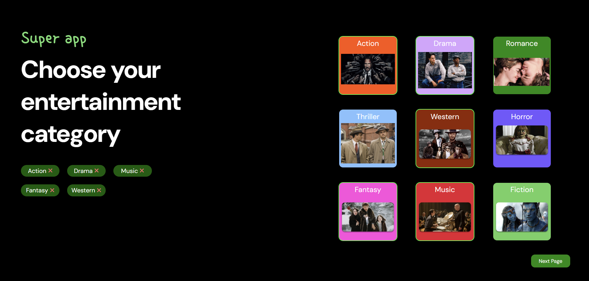

<h1 align="center" id="title">React Super App</h1>

<p id="description">Super App is a dynamic and interactive entertainment and task management app built using React. It is designed to offer a personalized and immersive entertainment experience. By integrating real-time weather data entertainment genres and a note-keeping section, the app serves as an all-in-one platform for users to manage their preferences and stay updated. Users can explore different entertainment genres track their favourite content view personalized weather information and organize their thoughts with the built-in notes feature. This responsive dashboard adapts seamlessly to various screen sizes, offering a consistent experience across devices. With additional features like a countdown timer, the app not only enhances the user's interaction with entertainment content but also focuses on usability and comfort.</p>

<h2>🚀 Demo</h2>

[https://react-super-app-ebon.vercel.app/](https://react-super-app-ebon.vercel.app/)


<h2>⚠️ Caution:</h2>

To resolve occasional issues with the TMDB API not loading movie data, please go to your browser's settings, navigate to Privacy and Security, and change the DNS to Google or Cloudflare. This should fix the problem.


<h2>Project Screenshots:</h2>





  
<h2>🧐 Features</h2>

Here're some of the project's best features:
 
  

*   User Profile Section: Displays the user's name contact details and selected favourite genres, allowing personalized entertainment suggestions.
* Weather API : https://api.weatherapi.com/v1 for real-time Weather Information. It fetches and displays the current weather based on the user's location, with details like temperature pressure wind speed and humidity. 
* TMDB movies API : https://api.themoviedb.org/3/discover/movie for entertainment genre selection: Users can select their preferred genres from a grid of options (e.g. Action Drama Music) and active selections are highlighted with a dynamic UI.
*   Notes Section: A dedicated area where users can add and view personal notes, helping them keep track of their to-do lists or thoughts related to the entertainment content.
*  Google books API : https://www.googleapis.com/books/v1/volumes for book details, and for presenting details about a random book including the title author and a brief description with a “Read More” option for further exploration.
*   Countdown Timer: A built-in timer feature that allows users to set a custom countdown, useful for managing screen time or other timed activities.
*   Responsive UI: The app layout adjusts seamlessly across different screen sizes, providing an optimized experience on both desktop and mobile devices.
*   404 Error Handling: A custom-designed 404 error page provides a user-friendly experience when users navigate to a non-existent route with an option to return to the homepage.
*   Protected Routes: User authentication ensures secure access to personalized features. The app utilizes industry-standard security measures to protect user data and prevent unauthorized access.

<h2>🛠️ Installation Steps:</h2>

<p>1. Clone the repository</p>

```
git clone https://github.com/191prajjwal/React-Super-App.git
```

<p>2. Install dependencies</p>

```
cd superapp 
npm install
```

<p>3. Run the development server</p>

```
npm run dev
```

<h2>🍰 Contribution Guidelines:</h2>

Feel free to contribute to this project by creating pull requests. Adhere to the existing code style and best practices.

  
  
<h2>💻 Built with</h2>

Technologies used in the project:

*   React
*   JavaScript
*   Module CSS
*   Context API
*   React-Router
*   Vite
*   Axios
*   Vercel

<h2>🛡️ License:</h2>

This project is licensed under the MIT License.

